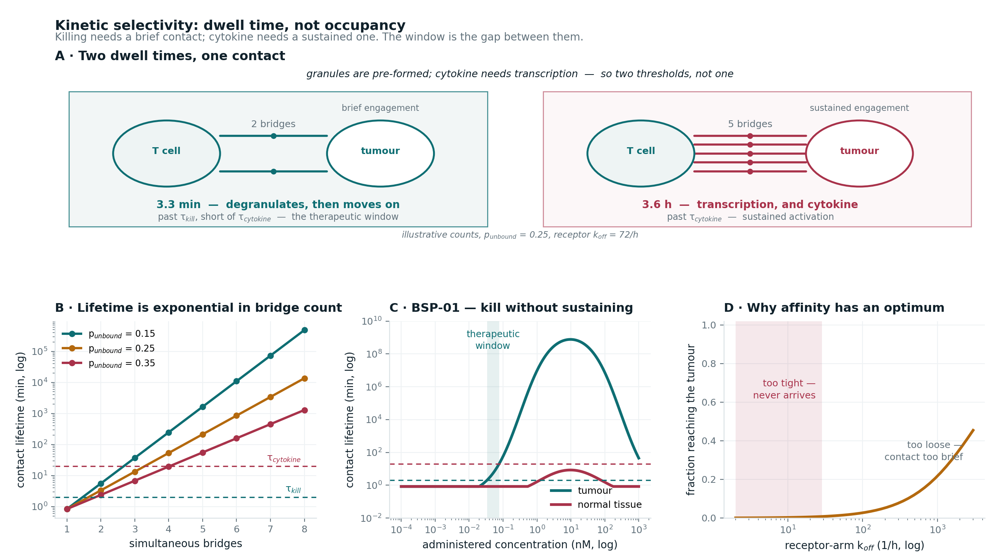

# kissrun

**A kinetic therapeutic-window screen for T-cell-engaging bispecifics.**

Most early screens ask *how much* bridge forms. This one asks *how long it lasts* — because
killing and cytokine release do not require the same engagement time, and the gap between
them is the therapeutic window.



> **Every number in this repository is illustrative.** No parameter here is taken from a real
> molecule, and none is fitted to data. What is transferable is the structure of the argument
> and the code that implements it — not the values. See *Honest limitations* below.

---

## The problem this exists to solve

A conventional equilibrium screen anchors efficacy on productive trimer and safety on receptor
occupancy. That gives a clean dosability corridor — and the corridor **only exists because the
two bounds sit on different molecular species**.

Re-anchor both on trimer, which is the more defensible mechanism, and the separation vanishes:

- on-tumour and off-tumour trimer curves peak at the **same concentration**, because target
  density moves peak height and never peak position
- their ratio is near-constant across the window
- avidity applies wherever both arms engage, so it helps the tumour and the bystander equally

The margin dissolves. Something else must be doing the discriminating.

## Two thresholds, not one

Cytolytic granules are **pre-formed and pre-loaded**, so degranulation follows quickly once
signalling begins. Mass cytokine production requires a **transcriptional programme**, which
needs a sustained signal. Two dwell times on the same axis:

| | dwell required | what follows |
|---|---|---|
| `tau_kill` | short | degranulation — the tumour cell dies |
| `tau_cytokine` | long | transcription — cytokine, and at scale, CRS |

**A contact between them kills and moves on.** That is kiss-and-run: serial killing without
sustained activation, and it is the rationale for tuning a receptor arm weak rather than tight.

So the window has two edges and both are kinetic:

```
lower edge   where the tumour contact first holds long enough to KILL
upper edge   where it holds long enough to drive CYTOKINE
```

Plus a third condition for selectivity: the normal-tissue contact must not even reach `tau_kill`.

## What makes the two thresholds reachable separately

A cell–cell contact held by *n* independent bridges ruptures only when **all of them are
momentarily unbound at the same instant**:

```
k_rupture  =  k_off · p_unbound^(n−1)
lifetime   =  1 / k_rupture
```

Lifetime is **exponential** in bond count while bond count is only **linear** in antigen density.
With a 20-fold density contrast between tumour and normal tissue:

| bonds | contact lifetime | relative |
|------:|-----------------:|---------:|
| 1 | 0.8 min | 1× |
| 2 | 3.3 min | 4× |
| 3 | 13 min | 16× |
| 5 | 3.6 h | 256× |

Because lifetime climbs so steeply, a small change in bridge count moves a contact from below
`tau_kill` to above `tau_cytokine`. That steepness is why the window is narrow, and why
affinity has to be tuned rather than maximised.

**An equilibrium model cannot represent this.** It has no `k_off`, so every trimer counts the
same regardless of how long it survives.

## The third layer: why the screen does not recommend infinite affinity

Dwell time alone would prefer an arbitrarily tight receptor arm. Real bispecifics are not
designed that way: receptor arms in this class are commonly tuned deliberately weak.

The counterweight is the **binding-site barrier**: a bispecific with a very tight receptor arm
binds the first T cell it meets in the periphery and never reaches the tumour core.

```
penetration  =  1 / (1 + receptor_peripheral / K_B)
```

No avidity applies here, because nothing is bridged in transit. The two effects oppose each
other and produce an optimum — which the `sweep_koff` output shows directly.

---

---

## The model, in equations

Four layers. Each takes the output of the one before.

### 1 · Binding — how much bridge forms

Rapid equilibrium with target depletion. Avidity enters as a fold tightening of both
effective dissociation constants once the assembled complex engages a surface with both arms:

```
a = K_A / avidity          b = K_B / avidity
```

The two conservation laws are coupled and solved by fixed-point iteration:

```
A_free  =  A_total / ( 1 + D/a + D·B_free / (a·b) )

B_free  =  B_total / ( 1 + D/b + D·A_free / (a·b) )
```

and the productive ternary complex follows:

```
T  =  D · A_free · B_free / (a · b)
```

**Two results fall out of this, and both are asserted in the test suite.** In the target-excess
limit the trimer peaks at the geometric mean of the effective affinities:

```
D*  =  √(K_A · K_B) / avidity
```

which depends only on the **product** of the two constants — so arms of 0.3 and 30 nM peak
exactly where arms of 3 and 3 do. And sweeping target density moves the peak **height** but
never its **position**: two separable levers.

### 2 · Barrier — how much drug arrives

A bispecific with a very tight receptor arm binds the first T cell it meets in the periphery
and never reaches the tumour core. No avidity applies, because nothing is bridged in transit:

```
f_penetration  =  1 / ( 1 + R_peripheral / K_B )

D_arriving     =  D_administered · f_penetration
```

This term is what stops the screen preferring unbounded affinity.

### 3 · Kinetics — how long the contact lasts

Bulk trimer becomes a bridge count at the interface through a gain that absorbs synapse area,
receptor mobility and the local concentrating effect:

```
n  =  g · T
```

A contact ruptures only when **every** bridge is momentarily unbound at the same instant, so
the rupture rate carries the unbound probability to the power of the remaining bridges:

```
k_rupture  =  k_off · p_unbound^(n−1)

τ          =  60 / k_rupture          minutes, for k_off in h⁻¹
```

At n = 1 this reduces to the single-bond lifetime. Each additional bridge multiplies τ by
1/p — **exponential in bridge count, while bridge count is only linear in target density.**

Inverting it gives the bridges needed to survive a given dwell time:

```
n*  =  1 + ln( 60 / (τ · k_off) ) / ln( p_unbound )
```

### 4 · Thresholds — what that duration produces

```
kills(D)      ⟺   τ(D) ≥ τ_kill
activates(D)  ⟺   τ(D) ≥ τ_cytokine
```

The therapeutic window is the largest **contiguous** set of concentrations satisfying all
three conditions at once:

```
W  =  { D :  τ_tumour(D) ≥ τ_kill          the tumour cell dies
          ∧  τ_tumour(D) <  τ_cytokine      without sustained activation
          ∧  τ_normal(D) <  τ_kill }        and normal tissue is untouched

margin  =  log₁₀( max W / min W )
```

Contiguity matters: a dosing range interrupted by a region of cytokine risk is not a window,
and reporting first-to-last would span the gap.

---

## Install and run

```bash
git clone https://github.com/tjmb03/bispecific_molecule_kissrun
cd bispecific_molecule_kissrun
pip install -e .
python scripts/run_screen.py
pytest -q
```

## Use

```python
from kissrun import Candidate, System, screen

lead = Candidate("BSP-01", ka=16.0, kb=1.0, avidity=21.0, koff_receptor=72.0)
result = screen(lead, System())

result["kill_onset_nM"]      # where the tumour contact first holds long enough to kill
result["cytokine_onset_nM"]  # where it holds long enough to drive cytokine
result["window_lo"]          # lower edge of the therapeutic window
result["window_hi"]          # upper edge
result["margin"]             # width of the window, in logs
result["penetration"]        # fraction of drug surviving the peripheral sink
result["verdict"]            # GO / NO-GO
```

## Structure

```
src/kissrun/
  binding.py     equilibrium ternary complex with target depletion; the peripheral barrier
  kinetics.py    multivalent contact lifetime; the kill and cytokine thresholds
  screen.py      the four layers combined into a therapeutic window
  validation.py  independent checks on the equilibrium layer
  identifiability.py  what can and cannot be calibrated
  panel.py       a synthetic candidate panel, built to exercise the levers
tests/           31 tests, including the analytical results pinned as assertions
scripts/         runner producing the tables and figures
```

## What the tests pin

The analytical assertions matter more than the numerical ones, because they hold regardless of
parameter values — a change that breaks them is a change to the physics.

- the trimer peaks at **√(K_A·K_B)** in the target-excess limit
- the peak depends only on the **product** of the arm affinities, so arms of 0.3 and 30 peak
  where arms of 3 and 3 do
- target density moves peak **height** but never **position**
- contact lifetime is exponential in bond count: each extra bond multiplies by 1/p
- `threshold_bonds` inverts the lifetime relation exactly
- `tau_kill < tau_cytokine`, so a window exists at all
- a contact between the two thresholds **kills without activating** — asserted directly
- the reported window is **contiguous**: every concentration inside it kills and none drives cytokine
- the `k_off` sweep is **not monotone** — the tight end fails on delivery

## Validation

```bash
python -c "from kissrun import validate; validate()"
```

Four independent checks on the equilibrium layer:

| check | what it tests | result |
|---|---|---|
| mass balance | bound + free = total at every concentration | 4.4 × 10⁻¹⁶ |
| independent root-finder | Brent's method on the same conservation equations, rather than fixed-point iteration | 9.9 × 10⁻¹⁵ |
| **ODE steady state** | **the full six-species kinetic scheme integrated forward** | **1.8 × 10⁻¹⁴** |
| drug depletion | how much drug the binding consumes | see below |

**The third is the one that earns its place.** The first two confirm the algebra was solved
correctly. Only the third confirms that solving it algebraically was legitimate — that binding
is fast enough for rapid equilibrium to hold. Rate constants are set so every dissociation
constant matches exactly, so a disagreement would be an assumption failure rather than a
parameter mismatch.

Cross-engine comparison in the sense used for stiff ODE systems does not apply to this layer.
There is no integrator, so three languages would agree trivially. The meaningful question is
whether the modelling assumption is sound, not whether the arithmetic is reproducible.

### What the validation exposed

Writing the ODE check surfaced an asymmetry worth stating plainly: **the algebraic layer
depletes targets but not drug.** It treats its argument as free drug and does not conserve it.

```
drug bound at the efficacy optimum     88 %
worst across the swept range           99 %
```

That is exact where drug is in excess, and standard for a screening model — but at the
optimum most of the drug is bound, so a model used for **dosing** rather than ranking must
conserve drug or it will overstate the free concentration. The screen compares candidates on a
common basis, which is unaffected; a dose projection would not be.

This is the kind of thing validation is for. The assumption was defensible and undocumented;
now it is defensible and quantified.

---

## Identifiability — what could be calibrated, and what could not

The kinetic layer *looks* like five parameters: synapse gain, unbound probability, receptor
off-rate, and the two dwell thresholds. It is not. Every verdict depends on them only through
**two** derived quantities.

The threshold condition is `g·T ≥ n*`, which rearranges to a threshold on trimer alone:

```
T_kill      =  n*(τ_kill,     p, k_off) / g
T_cytokine  =  n*(τ_cytokine, p, k_off) / g
```

**Five parameters, two identifiable combinations, three degrees of freedom that no screen
output can recover.** Raise the synapse gain and lengthen the dwell thresholds to compensate,
and every window is bit-for-bit identical:

```bash
python -c "from kissrun import report; report()"
```

| | T_kill (nM) | T_cytokine (nM) |
|---|---|---|
| as configured — `g`=40, `p`=0.25, τ = 2 / 20 min | 0.0407879 | 0.0823120 |
| alternative — `g`=80, `p`=0.50, τ = 4 / 40 min | 0.0407879 | 0.0823120 |

Different parameters. Identical thresholds. Identical windows, asserted to `rel_tol=1e-12`
across the whole panel.

### What follows from it

**Measuring `p_unbound` or the synapse gain would not change a single verdict.** They enter
only through the two thresholds, so a better estimate of either buys nothing. That is worth
knowing before commissioning the experiment.

**Calibrating `T_kill` and `T_cytokine` directly would change every verdict.** Two numbers,
against a molecule with known clinical behaviour — that is the experiment that matters, and it
is a smaller ask than it first appeared.

**And it bounds the claim.** The kinetic construction is a mechanistic account of *why* two
thresholds exist and why they differ — pre-formed granules against transcription. It is not
evidence that the particular values of `g`, `p` or `τ` used here are right, and nothing the
screen produces could make it so.

> This is the same discipline the validation section applies to the equilibrium layer: state
> what the model supports, not what it computes.

---

## Honest limitations

This is a methods demonstration on illustrative parameters. Three things are worth stating
plainly rather than discovering later.

**Both dwell thresholds are calibration parameters.** `tau_kill_min` and `tau_cytokine_min` are
not measured here. Their *ordering* is well founded — granules are pre-formed, transcription is
not — but their values set where every verdict falls. See *Identifiability* above for what can
and cannot be calibrated: it is two numbers rather than five, which is a smaller ask than it
first appears.

**The synapse gain is the least determined input — and is not separately identifiable.**
`synapse_gain` converts a bulk trimer concentration into a bridge count at the interface,
absorbing synapse area, receptor mobility and local concentrating effects. Because lifetime is
exponential in bridge count, the screen is *more* sensitive to it than to any binding constant —
but it enters only through the two trimer thresholds, so measuring it in isolation would not
change a verdict.

**Independent-bond rupture is an approximation.** Real multivalent contacts involve force
sharing, catch-bond behaviour and rebinding within the contact. The `p^(n−1)` form captures
the qualitative exponential scaling and not the detailed mechanics.

**Cytokine is treated as a threshold, not a cascade.** Crossing `tau_cytokine` is scored as a
binary event. Real CRS involves amplification through myeloid cells, saturation, and tolerance
that accumulates across doses — which is why step-up dosing works at all, and which a threshold
cannot represent.

**What it does not contain:** cytokine dynamics, tolerance accumulation across doses, T-cell
activation state, tumour or effector cell numbers, and any pharmacokinetics. Those belong in a
dynamic model. The comparison worth making is with the published in vitro QSP frameworks that
resolve the synapse on a per-cell basis with explicit 2D binding kinetics — this screen is
deliberately smaller, and answers a narrower question earlier.

---

## Where this sits

Part of **QSPplus** — mechanistic modelling for decisions that have to be made before the data
that would normally settle them exists.

The screen is designed for the moment when you have binding constants and target densities and
nothing else: it says whether a molecule can be selective at all, and which property to change
if it cannot.

MIT licensed. Issues and corrections welcome.
